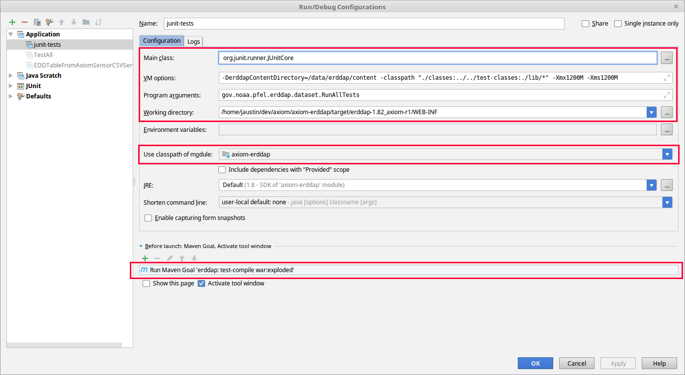

# ERDDAP - Axiom Style

### Development

#### Setup

1. Create the two directories required by ERDDAP:
    ```
    mkdir -p /data/erddap/content
    mkdir -p /data/erddap/data
    ```

2. Import project into IntelliJ as a `Maven Project`
   * Note: you will get compile errors because there are some files in this project that should be excluded (see the pom.xml). In the Build Messages window, right-click files with errors and choose `Exclude from Compile`.
3. Install DejaVu fonts (see http://coastwatch.pfeg.noaa.gov/erddap/download/setup.html)
4. Setup the default ERDDAP content using erddapContent.zip (see http://coastwatch.pfeg.noaa.gov/erddap/download/setup.html).  Copy files into `/data/erddap/content`.
5. Edit the setup.xml file, using `setup.example.xml` as a basis.

#### Axiom changes

Axiom specific code is in:

* `src/main/java/gov/noaa/pfel/erddap/dataset/EDDTableFromAxiomSensorCSVService.java`
* `src/main/java/gov/noaa/pfel/erddap/dataset/EDDTableFromAxiomStation.java`
* `src/main/java/gov/noaa/pfel/erddap/dataset/EDDTableFromAxiomStationV2.java`

#### Testing (JUnit)

To test this package, you can run JUnit tests in `src/test/java`.

##### Unit Tests

Unit tests can just be run like normal (within your IDE).

##### Integration Tests

Integration tests are more annoying, because everything in this project is static and has no dependency injection.

Before running integration tests, make sure you have the project set up as explained above.

Also, in `pom.xml`, remove the line `<scope>provided</scope>` under `<groupId>javax.servlet</groupId>`, and the line `<scope>test</scope>` under `<groupId>junit</groupId>`.

Then run on the command line with:

```bash
./run-integration-tests.sh
```

Or you can run (and debug!) in Intellij by going to Run > Edit Configurations, clicking the plus sign to Add New > Application, and filling in all the details. See screenshot:




#### Testing (run `main` methods)

To test this package, there is a main() method, so you can just run the file like so (replacing paths as needed):

Remove the line `<scope>provided</scope>` from the `pom.xml` under `<groupId>javax.servlet</groupId>`.

```bash
# All stations
$ mvn compile war:exploded && pushd . && cd target/erddap-1.82_axiom-r1/WEB-INF/ && java -DerddapContentDirectory=/data/erddap/content -classpath "./classes:./lib/*" -Xmx1200M -Xms1200M gov/noaa/pfel/erddap/dataset/EDDTableFromAxiomSensorCSVService; popd

# Individual stations
$ mvn compile war:exploded && pushd . && cd target/erddap-1.82_axiom-r1/WEB-INF/ && java -DerddapContentDirectory=/data/erddap/content -classpath "./classes:./lib/*" -Xmx1200M -Xms1200M gov/noaa/pfel/erddap/dataset/EDDTableFromAxiomStation; popd
```

### Build and run

First, make sure you have the project set up as explained above.

Then build:

```
docker build -t erddap-axiom .
```

And run:

```bash
docker run --name erddap-axiom \
    -p 8080:8080 \
      -v "/data/erddap/content:/usr/local/tomcat/content/erddap" \
      -v "/data/erddap/data:/data/erddap/data" \
      -v "/mnt/store/data:/mnt/store/data:ro" \
  erddap-axiom
```

Wait for it to start up, then go to http://localhost:8080/erddap/index.html

Also, check out the [erddap-docker ansible role](http://git.axiom/axiom/ansible-playbook-servers/blob/master/roles/erddap-docker/tasks/main.yml)
to see how ERDDAP is run in our datacenter.

### Syncing upstream

ugh. Ugh. UGH.

There is really no easy way to do this.  ERRDAP developer(s) do not include commit messages
in Git and usally put an entire release into a single commit.  That being said... as long as none of the external libraries change or additional ones are needed, you should try:

```
$ git clone https://github.com/BobSimons/erddap.git
$ cd erddap
$ export ERDDAP_UPSTREAM_ROOT=$(pwd)

$ cd ..
$ git clone git@git.axiom:axiom/erddap.git
$ cd erddap
$ export ERDDAP_DEV_ROOT=$(pwd)

# Using Python >= 3.5
(python35)$ python move_changed.py

# Do what the script outputs!
```

Now you will need to make a ton of changes to the source to get it to compile.  Pretty much a nightmare, but doable in a few hours.


Add back in to EDD.java:

```java
if (type.equals("EDDTableFromAxiomSensorCSVService")) return EDDTableFromAxiomSensorCSVService.fromXml(erddap, xmlReader);
if (type.equals("EDDTableFromAxiomStation")) return EDDTableFromAxiomStation.fromXml(erddap, xmlReader);
if (type.equals("EDDTableFromAxiomStationV1")) return EDDTableFromAxiomStationV1.fromXml(erddap, xmlReader);
if (type.equals("EDDTableFromAxiomStationV2")) return EDDTableFromAxiomStationV2.fromXml(erddap, xmlReader);
```

